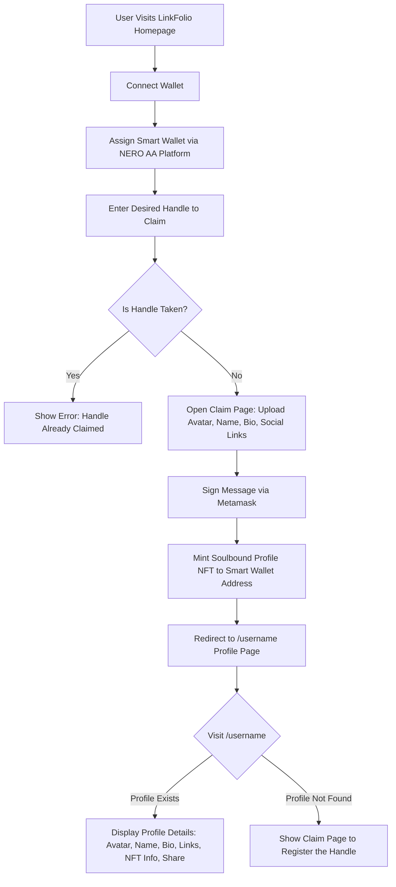

# LinkFolio - Decentralized, Portable, and Ownable link profiles as NFTs

LinkFolio is a platform enabling users to craft personalized digital profiles transformed into non-fungible tokens (NFTs). Seamlessly curate your profile with a bio, avatar, and custom links to social media, portfolios, and more. With LinkFolio, your digital identity becomes a unique NFT asset, offering ownership and authenticity. Whether you're a creator, influencer, or professional, LinkFolio provides a streamlined solution to manage your digital presence as valuable NFTs.

Built on NERO Chain, LinkFolio leverages native Account Abstraction (AA) and Paymaster infrastructure to deliver a gasless, seamless onboarding experience. Users can claim and update their profiles without ever needing to hold or manage gas tokens, eliminating a major barrier to Web3 adoption.

Craft your unique bio, avatar, and links to social media as properties and attributes of your nft. Own your soulbound digital identity effortlessly fully onchain. Think of it as web3 version of linktree profile as digital collectible.

### Features

- **Gasless Experience:** Powered by NERO Chain Paymaster, users can interact without paying gas fees using ETH or stablecoins.
- **Native Account Abstraction:** Streamlines wallet interactions and enhances user experience through smart contract-based wallets.
- **Customizable Profiles:** Personalize your profile with a bio, avatar, and custom links.
- **Soulbound NFTs:** Each profile is minted as a unique non transferrable NFT, offering ownership and authenticity.
- **On-chain Metadata:** Store profile data directly on-chain, ensuring data integrity and immutability.
- **User-Friendly DApp:** Claim, curate and update your social links securely and intuitively.

### UX Flow



In LinkFolio, I prioritize on-chain metadata to safeguard the integrity and permanence of NFT content. Unlike many platforms, it ensure that the symbolic value of NFT ownership remains secure and untampered by storing all metadata directly on the blockchain. This approach prevents data manipulation and loss, preserving the unique nature and exclusivity of each NFT.


**Contract Address:** [0xfaf07923e3ed82a432c7f7b2b6a976d0d38817fe](https://testnet.neroscan.io/address/0xfaf07923e3ed82a432c7f7b2b6a976d0d38817fe?tab=Transactions). Deployed on Nerochain Testnet.

## Getting Started

### 1. Deploying the Smart Contracts

This project is scaffolded using [hardhat](https://hardhat.org/docs). Please refer to the documentation for more information on folder structure and configuration.

> Copy the `.env.example` file to `.env` and update the environment variables with your own values.

```bash

npm install

npx hardhat compile

npx hardhat ignition deploy ./ignition/modules/LinkFolio.ts --network neroTestnet
```

### Paymaster and AA Integration

The core implemtation of Paymaster and Account Abstraction(AA) can be found in [`client/app/utils/aaUtils.js`](client/app/utils/aaUtils.js)

Interaction flow is demonstrated in [Creation, Update, Delete of Profiles](client/app/[handle]/page.client.jsx#L181) and in [Creation of posts and notes](client/app/components/ProfileCard.jsx#L62),
where the user is prompted to sign a message to create a profile, post or note. The Paymaster handles the gasless transaction and the AA SDK manages the smart contract wallet interactions.

### Demo


### ChangeLog

#### 0.2.0

- Added notes feature for profiles to let community members leave quick thoughts or messages.
- Added posts feature for profile owners to share updates or announcements.
- Integrated NERO Account Abstraction (AA) and Paymaster for gasless note and post creation.
- Added subgraph for indexing and querying profile data, posts, notes.
- Added Explore section in home page to discover community profiles with search and filter options using subgraph.
- Added profile metadata for individual handle pages to enable rich link previews when shared.

#### 0.1.0 - Initial Release

- Initial release of LinkFolio, a decentralized platform for creating and managing personalized digital profiles as NFTs.
- Integrated NERO platform AA and paymaster for seamless user experience.
- Users can create, update, and manage their profiles with a bio, avatar, and custom links.

### References

- [Dapp Architecture - Nero Chain](https://docs.nerochain.io/en/getting-started/nero-dapp-architecture)
- [AA Wallet Integration - NERO Chain](https://docs.nerochain.io/en/tutorials/aa-wallet-integration)
- [Create your first Dapp - NERO Chain](https://docs.nerochain.io/en/tutorials/create-first-dapp)
- [Openzeppelin ERC721 DOCS](https://docs.openzeppelin.com/contracts/5.x/erc721)
- [ERC721 Metadata Standards](https://docs.opensea.io/docs/metadata-standards)
- [ERC721 Soulbound Reference](https://ethereum.stackexchange.com/a/161807)
- [ERC721 Onchain Metadata](https://andyhartnett.medium.com/solidity-tutorial-how-to-store-nft-metadata-and-svgs-on-the-blockchain-6df44314406b)
- [Constructing Onchain Metadata directly in tokenURI without storing offchain](https://stackoverflow.com/a/70924789)
- [Appkit Overview](https://docs.reown.com/appkit/overview)

## Built With

- [NERO Chain](https://nerochain.io/) - Fully Modular Blockchain Architecture for Enhanced Adaptation and Performance
- [NERO Chain Platform Paymaster](https://nerochain.io/paymaster) - Allows seamless gas sponsorships, gas fee payments using any token or stablecoin of your choice
- [NERO Chain AA sdk](https://docs.nerochain.io/en/developer-tools/user-op-sdk) - Native account abstraction support for enhanced security and privacy by Nerochain
- [Hardhat](https://hardhat.org/) - Ethereum development environment for professionals
- [Reown Appkit](https://reown.com/appkit) - The full stack toolkit to build onchain app UX.
- [Ethers.js](https://docs.ethers.io/v5/) - A complete and compact library for interacting with the Ethereum Blockchain and its ecosystem.
- [Next.js](https://nextjs.org/) - The React Framework for Production.
- [Ant Design](https://ant.design/) - A design system for enterprise-level products. Create an efficient and enjoyable work experience.

## Safety

This is experimental software and subject to change over time.

This is a proof of concept and is not ready for production use. It is not audited and has not been tested for security. Use at your own risk. I do not give any warranties and will not be liable for any loss incurred through any use of this codebase.

## License

This project is licensed under the MIT License - see the [LICENSE](LICENSE) file for details.
